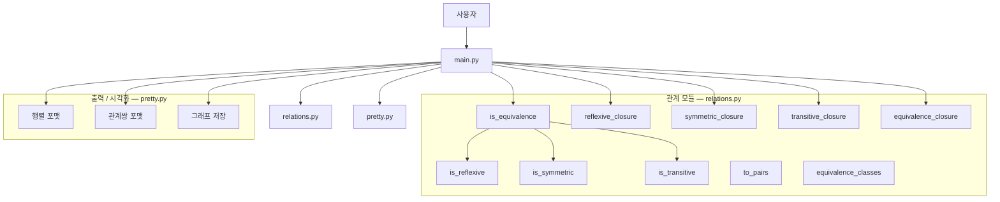
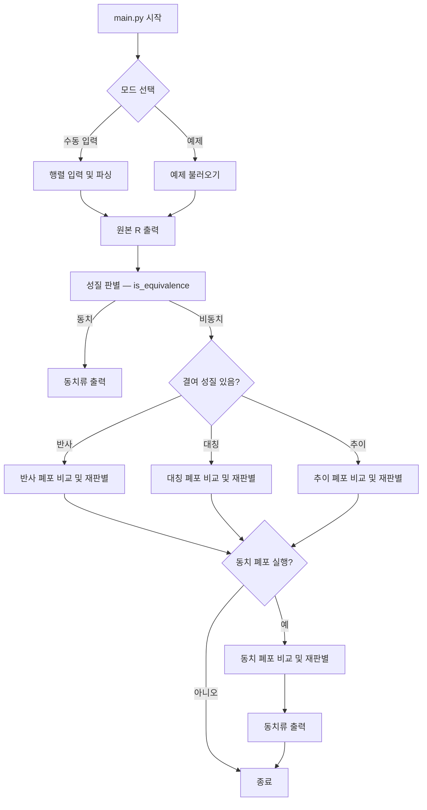

<div align="center">

# 동치 관계 판별기

**집합 A = {1, 2, 3, 4, 5} 위의 이항관계가 동치 관계인지 판별하고, 아닐 경우 폐포를 계산하는 CLI 도구**

[English](README.md) | 한국어

</div>

---

## 개요

5×5 관계행렬(집합 A = {1, 2, 3, 4, 5})을 입력받아:

1. **반사성**, **대칭성**, **추이성** 판별
2. **동치 관계** 여부 판정
3. 동치 관계일 경우 **동치류** 출력
4. 결여된 성질에 대해 **폐포** (반사 / 대칭 / 추이 / 동치) 생성 및 전후 비교
5. 선택적으로 관계의 **유향 그래프 시각화** 저장

## 프로젝트 구조

| 파일 | 역할 |
|------|------|
| `main.py` | CLI 진입점 — 입력, 검증, 오케스트레이션, 그래프 옵션 |
| `relations.py` | 성질 판별, 폐포(DSU 기반), 관계쌍 변환, 동치류 계산 |
| `pretty.py` | 행렬/관계쌍 포매팅, 선택적 그래프 시각화 |
| `requirements.txt` | 선택적 시각화 의존성 (`networkx`, `matplotlib`) |

## 아키텍처



## 런타임 흐름



## 실행 환경

- **Python 3.10+** 권장

선택적 그래프 시각화를 사용하려면:

```bash
pip install -r requirements.txt
```

## 실행 방법

```bash
python3 main.py
```

대화형 CLI에서 다음을 선택합니다:

1. 입력 방식 — 수동 5×5 행렬 입력 또는 내장 프리셋 (`even` / `non_equiv`)
2. 그래프 이미지 저장 여부 및 출력 디렉터리

### 수동 입력 형식

5행을 입력하며, 각 행은 공백으로 구분된 `0` 또는 `1` 다섯 개입니다:

```
1 0 1 0 1
0 1 0 1 0
1 0 1 0 1
0 1 0 1 0
1 0 1 0 1
```

## 출력 내용

| 섹션 | 설명 |
|------|------|
| 원본 관계 R | 헤더 포함 행렬, 관계쌍 목록, 선택적 그래프 |
| 성질 판별 결과 | 반사 / 대칭 / 추이 여부 및 동치 관계 판정 |
| 동치류 | 동치 관계인 경우에만 출력 |
| 폐포 | 결여된 성질에 대해서만 생성; 전/후 행렬 비교, 추가된 쌍 `*` 강조, 재판별 |
| 동치 폐포 | 한 번에 동치 관계로 만드는 폐포, 전/후 비교 및 동치류 출력 |

## 예제

### 홀짝 동치

```bash
$ python3 main.py
# 프리셋 선택: even
# 그래프: n

성질 판별 결과
  반사(reflexive): 예
  대칭(symmetric): 예
  추이(transitive): 예
  동치관계 여부: 동치 관계입니다.

동치류
  {1, 3, 5}
  {2, 4}
```

### 비동치 → 동치 폐포 생성

```bash
$ python3 main.py
# 프리셋 선택: non_equiv
# 그래프: n

성질 판별 결과
  반사(reflexive): 아니오
  대칭(symmetric): 아니오
  추이(transitive): 아니오
  동치관계 여부: 동치 관계가 아닙니다.

# 동치 폐포 생성: y

동치 폐포 적용 후
  반사(reflexive): 예
  대칭(symmetric): 예
  추이(transitive): 예
  동치관계 여부: 동치 관계입니다.

동치류
  {1, 2, 3, 4, 5}
```

## 참고사항

- 그래프 라이브러리가 설치되지 않은 경우, 그래프 저장은 자동으로 건너뛰며 경고 메시지가 출력됩니다.
- 입력 데이터는 0/1만 허용되며, 형식 오류 시 재입력을 요청합니다.
