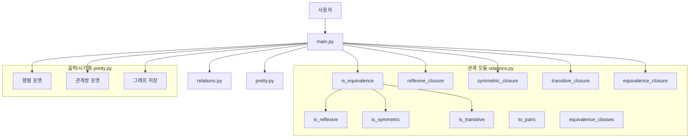
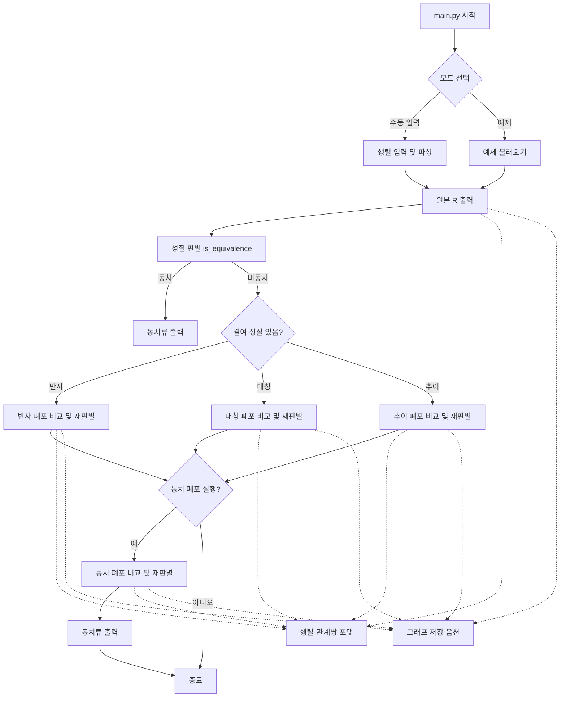
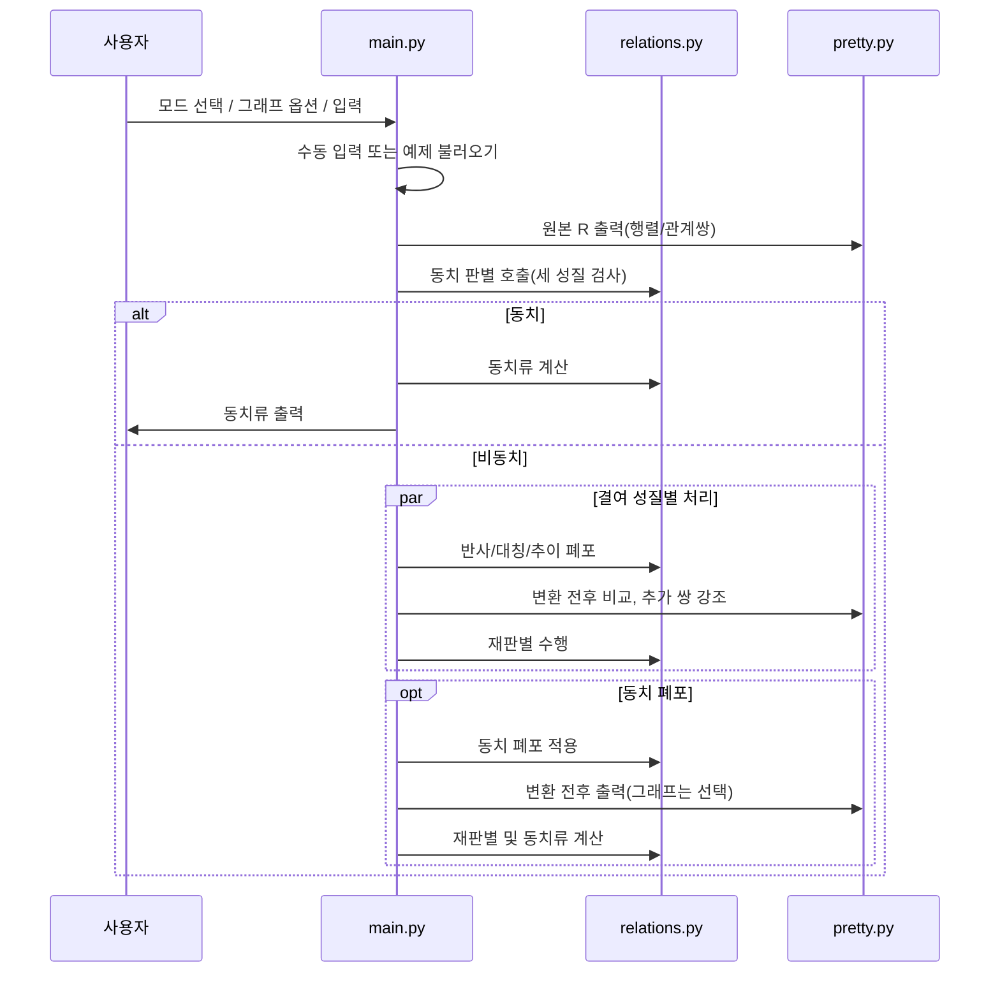

## 동치 관계 판별기 (CLI, Python) — A = {1,2,3,4,5}

이 스크립트는 5×5 관계행렬(집합 A={1,2,3,4,5})을 입력받아 반사/대칭/추이를 판별하고, 동치 관계 여부 및 동치류를 출력합니다.  
또한 필요할 경우(해당 성질이 없을 때만) 반사·대칭·추이 각각의 폐포를 생성하여 변환 전/후 비교 및 재판별 결과를 제공합니다.  
선택적으로 관계 그래프 이미지를 저장할 수 있습니다.


### 구성 파일
- `main.py` : CLI 진입점. 입력/검증, 판별, 폐포 처리, 출력, 그래프 옵션
- `relations.py` : 반사/대칭/추이 판별, 각 폐포, 동치류(DSU), 관계쌍 변환 로직
- `pretty.py` : 행렬/관계쌍 포매팅, 그래프 시각화 유틸
- `requirements.txt` : 선택적 시각화 라이브러리


### 실행 환경
- Python 3.10+ 권장

선택적 그래프 시각화를 사용하려면 아래를 설치하세요.

```bash
pip install -r requirements.txt
```


### 프로그램 구조/흐름
1) 입력 수집: 5×5 행렬(수동) 또는 예제 프리셋 선택(even/non_equiv)
2) 원본 출력: 행렬/관계쌍 출력, 선택 시 그래프 저장
3) 성질 판별: 반사·대칭·추이 여부 및 동치 여부 출력
4) 동치류: 동치인 경우에만 각 동치류 집합 출력
5) 폐포: 부족한 성질(반사/대칭/추이)만 해당 폐포를 생성해 전/후 비교 및 재판별
6) 동치 폐포(선택): 한 번에 동치 폐포를 생성해 전/후 비교 및 동치류 출력


### 아키텍처/코드 구조

모듈 구성
- `main.py`: CLI 오케스트레이션(입력/검증/출력), 성질 판별 호출, 폐포 처리, 그래프 옵션 처리
- `relations.py`: 반사/대칭/추이 판별, 각 폐포, 동치 폐포, 관계쌍 변환, 동치류 계산
- `pretty.py`: 행렬/관계쌍 포맷 및 그래프 시각화(선택)

데이터 모델
- `Matrix = List[List[int]]`
- `ELEMENTS = [1,2,3,4,5]`, `N = len(ELEMENTS)`

아키텍처 다이어그램 (Mermaid)


런타임 흐름 (Mermaid)


시퀀스 다이어그램 (Mermaid)



### 실행 방법
- 실행하면 대화형으로 다음을 선택합니다.
  1) 입력 방식: 수동 입력 / 예제(even, non_equiv)
  2) 그래프 저장 여부(y/n) 및 출력 디렉터리

```bash
python3 main.py
```


### 입력 형식 (수동 입력 시)
- 총 5행, 각 행마다 공백으로 구분된 `0` 또는 `1` 다섯 개를 입력합니다.
- 형식 오류 시 다시 입력을 요청합니다.

예:
```
1 0 1 0 1
0 1 0 1 0
1 0 1 0 1
0 1 0 1 0
1 0 1 0 1
```


### 출력 내용
1) 원본 관계 R
- 예쁜 행렬 출력(헤더/구분선 포함)
- 관계쌍 목록 출력
- 그래프 저장을 선택하면 `outputs/graph_original.png` 저장

2) 성질 판별 결과
- 반사(reflexive)/대칭(symmetric)/추이(transitive) 여부
- 동치 관계 여부

3) 동치류
- 동치 관계인 경우 집합 A의 각 원소에 대한 동치류를 출력

4) 폐포(필요 시에만 생성)
- “반사/대칭/추이 관계가 아닐 경우에만” 해당 폐포를 생성
- 각 폐포 섹션에서 변환 전/후 행렬·관계쌍 출력
- 변환 후에 새로 추가된 관계쌍은 `*`로 강조 표시
- 변환 후 성질 재판별 및 동치류(동치이면) 출력
- 그래프 저장을 선택하면 변환 전/후 이미지를 `outputs/graph_before_*.png`, `outputs/graph_*.png`로 저장

5) 동치 폐포(추가기능)
- 원한다면 한 번에 동치 폐포(Equivalence Closure)를 생성해 변환 전/후 비교 및 재판별, 동치류 출력을 확인할 수 있습니다.


### 옵션 요약
- 대화형으로 선택: 그래프 저장 여부, 출력 디렉터리, 예제 선택(또는 수동 입력), 동치 폐포 생성 여부


### 예제
- 홀짝 동치(동치류: `{1,3,5}`, `{2,4}`):

실행 후 예제에서 `홀짝 동치(even)`를 선택하고 그래프 저장을 `y`로 선택하세요.

- 비동치 입력 → 해당 성질의 폐포만 생성하여 비교:

실행 후 예제에서 `비동치(non_equiv)`를 선택하고 그래프 저장을 `y`로 선택하세요.


### 실행 예시

홀짝 동치(even)

```bash
$ python3 main.py
실행 모드 선택 ...
번호를 선택하세요 [1]: 2
그래프 이미지를 저장하시겠습니까? (y/n) [n]: n

원본 관계 R ...
성질 판별 결과
반사(reflexive): 예
대칭(symmetric): 예
추이(transitive): 예
동치관계 여부: 동치 관계입니다.

동치류
{1, 3, 5}
{2, 4}
```

비동치(non_equiv) + 동치 폐포 생성

```bash
$ python3 main.py
실행 모드 선택 ...
번호를 선택하세요 [1]: 3
그래프 이미지를 저장하시겠습니까? (y/n) [n]: n

원본 관계 R ...
성질 판별 결과
반사(reflexive): 아니오
대칭(symmetric): 아니오
추이(transitive): 아니오
동치관계 여부: 동치 관계가 아닙니다.

동치 폐포(한 번에)도 생성/확인할까요? (y/n) [y]: y
동치 폐포 (Equivalence Closure) ...
성질 판별 결과
반사(reflexive): 예
대칭(symmetric): 예
추이(transitive): 예
동치관계 여부: 동치 관계입니다.

동치류
{1, 2, 3, 4, 5}
```


### 과제 명세 대응
- 관계 행렬 입력(5×5, 행 단위): `main.py`의 `input_matrix()`
- 동치 관계 판별(반사/대칭/추이): `relations.py`의 `is_reflexive/is_symmetric/is_transitive/is_equivalence`
- 동치류 출력: `relations.py`의 `equivalence_classes()`
- 폐포(필요 시에만 생성): `relations.py`의 `reflexive_closure/symmetric_closure/transitive_closure` + `main.py`에서 없는 성질만 처리
- 관계쌍/행렬 예쁜 출력: `pretty.py`의 `format_matrix/format_pairs`
- 그래프 시각화(가점): `pretty.py`의 `draw_graph` (옵션)


### 참고사항
- 그래프 라이브러리가 설치되지 않은 경우, 그래프 저장은 자동으로 건너뛰며 경고 메시지가 출력됩니다.
- 입력 데이터는 0/1만 허용되며, 형식 오류 시 재입력을 요청합니다.
