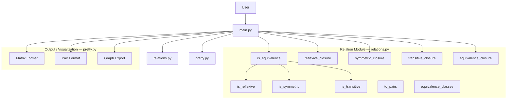
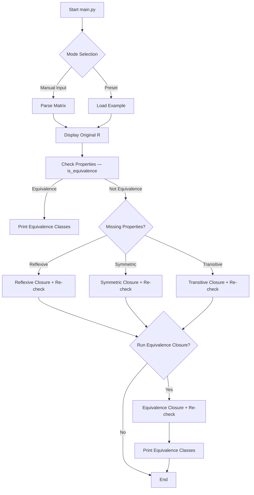

<div align="center">

# Equivalence Relation Discriminator

**A CLI tool that determines whether a binary relation on A = {1, 2, 3, 4, 5} is an equivalence relation — and computes closures when it isn't.**

English | [한국어](README.ko.md)

</div>

---

## Overview

Given a 5×5 relation matrix on the set A = {1, 2, 3, 4, 5}, this Python CLI:

1. Determines **reflexivity**, **symmetry**, and **transitivity**
2. Reports whether the relation is an **equivalence relation**
3. Computes and displays **equivalence classes** when it is
4. Generates **closures** (reflexive / symmetric / transitive / equivalence) for missing properties
5. Optionally saves **directed graph visualizations** of the relation before and after each closure

## Project Structure

| File | Role |
|------|------|
| `main.py` | CLI entry point — input, validation, orchestration, graph options |
| `relations.py` | Property checks, closures (DSU-based), pair conversion, equivalence classes |
| `pretty.py` | Matrix/pair formatting, optional graph visualization |
| `requirements.txt` | Optional visualization dependencies (`networkx`, `matplotlib`) |

## Architecture


```mermaid
graph TD
  U[User] --> M[main.py]
  M --> R[relations.py]
  M --> P[pretty.py]

  subgraph REL [Relation Module — relations.py]
    IR[is_reflexive]
    IS[is_symmetric]
    IT[is_transitive]
    IE[is_equivalence]
    RC[reflexive_closure]
    SC[symmetric_closure]
    TC[transitive_closure]
    EC[equivalence_closure]
    TP[to_pairs]
    CLS[equivalence_classes]
  end

  subgraph PRETTY [Output / Visualization — pretty.py]
    FM[Matrix Format]
    FP[Pair Format]
    DG[Graph Export]
  end

  M --> IE
  IE --> IR
  IE --> IS
  IE --> IT

  M --> RC
  M --> SC
  M --> TC
  M --> EC

  M --> FM
  M --> FP
  M --> DG
```

## Runtime Flow


```mermaid
flowchart TD
  A[Start main.py] --> B{Mode Selection};
  B -->|Manual Input| C[Parse Matrix];
  B -->|Preset| C2[Load Example];

  C --> D[Display Original R];
  C2 --> D;

  D --> E[Check Properties — is_equivalence];
  E -->|Equivalence| F[Print Equivalence Classes];
  E -->|Not Equivalence| G{Missing Properties?};

  G -->|Reflexive| H1[Reflexive Closure + Re-check];
  G -->|Symmetric| H2[Symmetric Closure + Re-check];
  G -->|Transitive| H3[Transitive Closure + Re-check];

  H1 --> I{Run Equivalence Closure?};
  H2 --> I;
  H3 --> I;

  I -->|Yes| J[Equivalence Closure + Re-check];
  I -->|No| K[End];

  J --> L[Print Equivalence Classes];
  L --> K;
```

## Requirements

- **Python 3.10+**

For optional graph visualization:

```bash
pip install -r requirements.txt
```

## Usage

```bash
python3 main.py
```

The interactive CLI prompts you to:

1. Choose input mode — manual 5×5 matrix or a built-in preset (`even` / `non_equiv`)
2. Choose whether to save graph images (and output directory)

### Manual Input Format

Enter 5 rows, each containing five space-separated `0` or `1` values:

```
1 0 1 0 1
0 1 0 1 0
1 0 1 0 1
0 1 0 1 0
1 0 1 0 1
```

## Output

| Section | Description |
|---------|-------------|
| Original Relation R | Pretty-printed matrix with headers, list of ordered pairs, optional graph |
| Property Check | Reflexive / Symmetric / Transitive status and equivalence verdict |
| Equivalence Classes | Displayed only when the relation is an equivalence relation |
| Closures | Generated only for missing properties; shows before/after matrix, highlights new pairs with `*`, re-checks properties |
| Equivalence Closure | One-step closure to equivalence with full before/after comparison |

## Examples

### Even-Odd Equivalence

```bash
$ python3 main.py
# Select preset: even
# Graph: n

Property Check
  Reflexive:  Yes
  Symmetric:  Yes
  Transitive: Yes
  Equivalence Relation: Yes

Equivalence Classes
  {1, 3, 5}
  {2, 4}
```

### Non-Equivalence → Equivalence Closure

```bash
$ python3 main.py
# Select preset: non_equiv
# Graph: n

Property Check
  Reflexive:  No
  Symmetric:  No
  Transitive: No
  Equivalence Relation: No

# Choose equivalence closure: y

After Equivalence Closure
  Reflexive:  Yes
  Symmetric:  Yes
  Transitive: Yes
  Equivalence Relation: Yes

Equivalence Classes
  {1, 2, 3, 4, 5}
```

## Notes

- If graph libraries are not installed, graph export is silently skipped with a warning.
- Invalid input (non-0/1 values, wrong dimensions) triggers a re-prompt.
